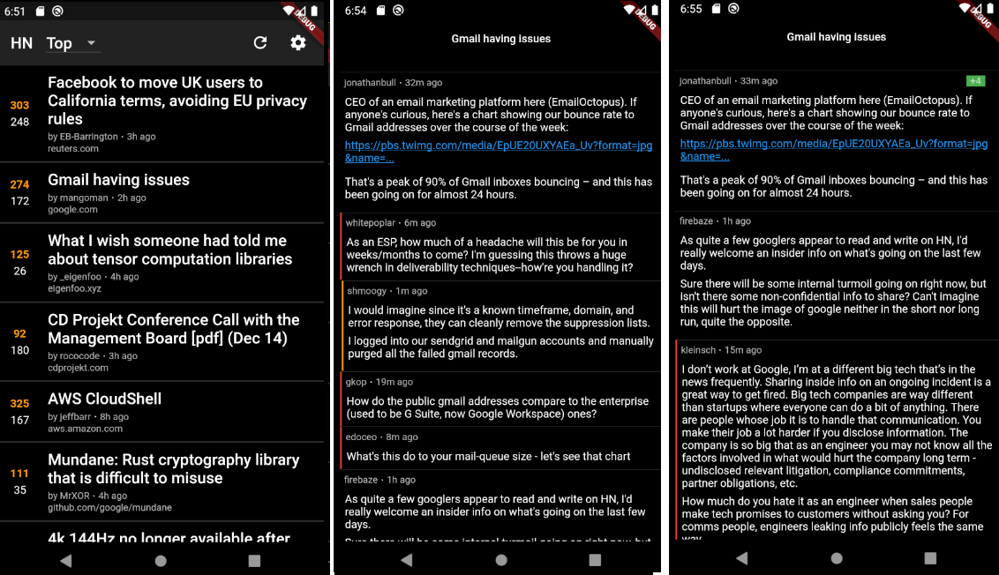

# hacker_news

Current state

API
- https://hn.algolia.com/api
- https://github.com/HackerNews/API

Things to do 
- [x] get initial story IDs to make a list 
- [x] find a way to get each story title, probably async for each one? 
- [x] display the list of stories in a list
- [x] some sort of fetch operation to get more stories as user scrolls further
- [ ] some sort of caching to get a bunch of stories up front and not require internet for every refresh
- [x] some sort of basic styling on the list items
- [x] switch between story list modes above (top, new, best, etc), selectable from some kind of list/dropdown/option
- [x] clicking a story title opens the link in a browser
- [x] make a new window for comment viewing
- [x] use some sort of BFS with depth limits to get comments in a nice way
- [ ] cache fetched comment tree structure somehow
- [ ] clicking something on the story title in the list, opens comment view window
- [ ] ability to favorite a story or comment
- [ ] clicking something on a comment opens a user's profile 
- [ ] search menu with angolia api, results are similar to story list view
- [ ] settings for font size, color theme, caching options, etc
- [x] drag down to refresh
- [ ] integration tests 
- [ ] better styling on the list cards
- [x] cards need to make their elements use percentage based sizing or something flexy
- [ ] add an app icon and name so it's not just `hacker_news` with the default flutter icon on my phone 
- [x] better styling for "waiting" and "error" fetch states
- [x] show some kind of indication when refreshing or fetching state. Alternatively, an animation when fetching finishes?
- [x] comment body is raw HTML, needs to be processed into rich text with clickable URLs and styling
- [x] depth of comments needs better visual indication
- [ ] consolidate all helper functions such as launchURL etc
- [ ] option to open comment or url directly from main list view
- [ ] collapsible comments
- [ ] start profiling memory and network usage
- [ ] definitely feels like comments are taking too long to load. Is there a better, faster way to load them?
- [ ] in the "comments" page, the top would be nice to only load when scrolling up. I think SliverAppBar and SliverList can help here? Maybe try sliver list instead of list view in some places.